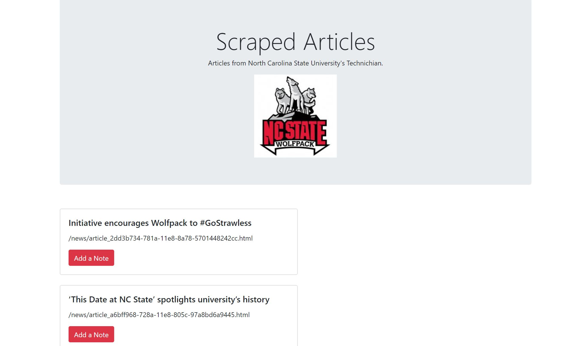
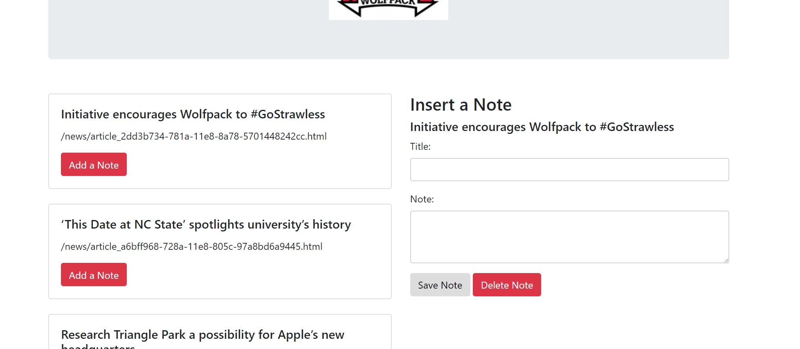
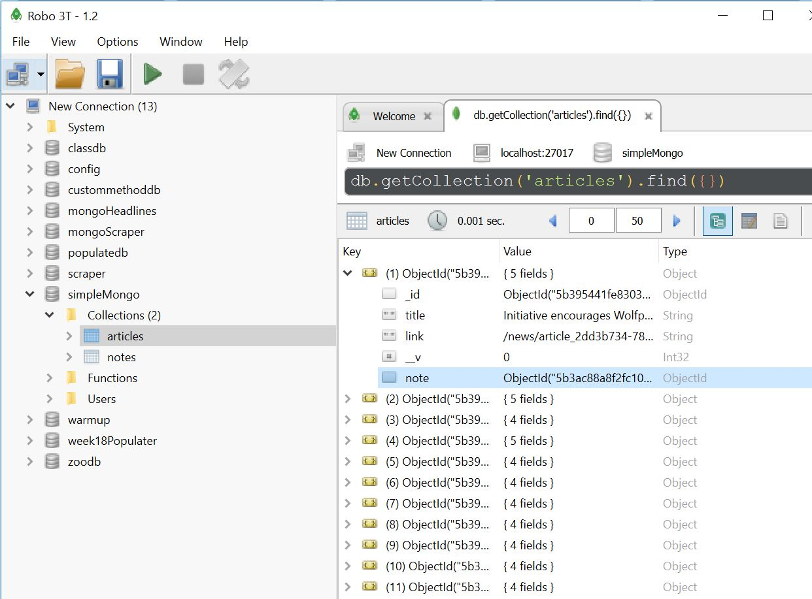
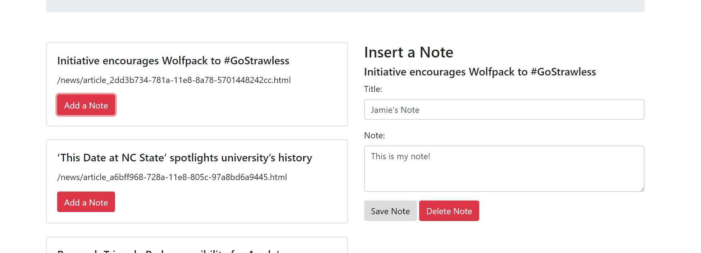

# simple-mongo

Simple mongo is a simple web scraping application that uses node packags to scrape articles from the NCSU Technician website and allows the user to add and delete notes.

Node packages used include Express for the server, Cheerio and Request for web scraping, Mongo and Mongoose for the database, and body-parser.

While this application is not the fully functioning goal, here are some of the features it provides:

The page is initalized with the scraped articles displayed:

When a user presses any of the add note buttons, a user form pops up ready for user input:

The user can enter their note title and body and when the save note button is clicked, the note is saved in the database and will remain until the note is deleted:

The delete button is not functional but would ideally use mongoose and the deleteOne() method to remove the note document from the database. An ajax call would be used to capture the id of the note being deleted and would tell the backend what to remove. A delte route would handle the removal of the note from the database.

Handlebars were note used in this simple app but would be utilized in the full app. A handlebars object would be created (article) that would be passed to the index.handlebars file to loop through and display on the DOM every article in the database.

Finally, in the fully realized app, the summary would be viewable along with the atricle's title and link. I would have also liked to include the article's matching image. I would need to scrape from an html tag that includes everything I want and use dot chaining of children() to drill down into the respective tags. I ran into the issue of pulling too many or not enough articles. I would use conditional logic to fix this but never got it to work exactly like I wanted it to.

This application is not fully functional, even on the deployed heroku site, but I did have a litle success on my locally supported database. I'm disappointed with how little I was able to accomplish and hope to take from this experience how I should approach things for future applications.